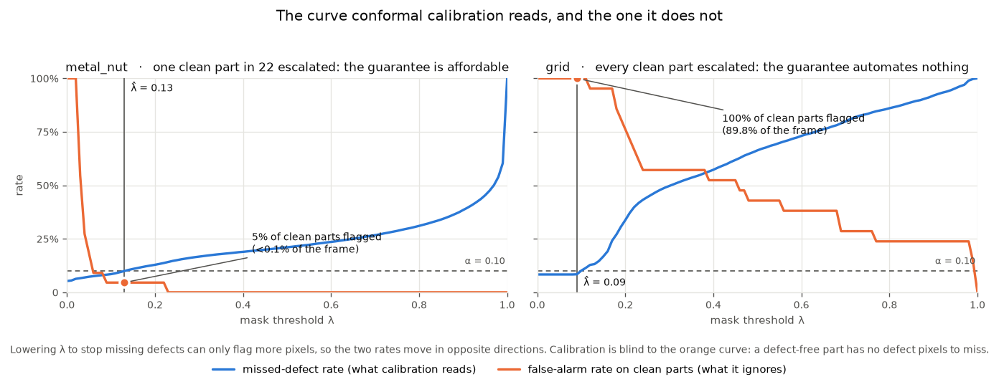

# conformal-seg

[](https://github.com/mateus-aleixo/conformal-seg/actions/workflows/ci.yml)


**Industrial defect segmentation whose masks carry a guarantee.** A torchvision
segmentation model is fine-tuned on MVTec AD defects and thresholded by **conformal
risk control**, so that the predicted defect region provably misses at most α of the
true defect pixels (pixel-level false-negative rate ≤ α, finite-sample and
distribution-free). The model is exported to ONNX with a parity check, and inference
runs torch-free.

Second of a series applying a single principle, *a prediction without a trustworthy
confidence statement is not a decision aid*, to three different kinds of data:

| repo | modality | the guarantee |
|---|---|---|
| [conformal-rul](https://github.com/mateus-aleixo/conformal-rul) | sensor sequences | RUL intervals with verified coverage, live on AWS Lambda |
| **conformal-seg** | vision | defect masks bounding the missed-defect rate |
| [conformal-rag](https://github.com/mateus-aleixo/conformal-rag) | language | selective QA that abstains at a calibrated error rate |


*Top row: the method earning its keep. The calibrated mask is barely larger and
misses a third as much. Bottom row: the same method on a category the model never
learned, honouring its 10% promise by covering most of the frame. Both rows show the
test image closest to that category's held-out mean, not the best-looking one.*

## Results

Full numbers in [`docs/results.md`](docs/results.md). The short version:

| | naive 0.5 | conformal | false alarms on clean parts | verdict |
|---|---|---|---|---|
| `metal_nut` | IoU 0.691, **FNR 0.167 ✗** | IoU 0.644, **FNR 0.055 ✓** | 0.000 → **0.045** (1 of 22) | the guarantee costs about 5 IoU points and one false alarm in 22, and fixes a 17% miss rate |
| `grid` | IoU 0.184, FNR 0.385 ✗ | IoU 0.015, **FNR 0.010 ✓**, **mask area 0.81** | 0.429 → **1.000** (21 of 21) | the guarantee is honoured by escalating every clean part: valid, and useless |

`grid` is reported rather than buried. Conformal risk control guarantees *validity,
not utility*, and a category where the model fails is the clearest way to show what
the method does and does not buy you.

The last column is the point of the **defect-free control split**. The conformal loss
is the fraction of true defect pixels a mask misses, so a part with no defects
contributes zero loss whatever the mask does: the guarantee is blind, by
construction, to how often a good part gets stopped. Scoring the same models on
MVTec's untouched `test/good/` images answers it. On `metal_nut` the guarantee is
nearly free, one clean part in 22. On `grid` it escalates **all of them**, which
turns "the mask is too big" from an aesthetic complaint into a throughput of zero.



## Why put a guarantee on a mask

The industrial question is never "colour the defect pixels". It is **"can this part
ship without a human looking at it?"** A raw sigmoid threshold gives no answer,
because 0.5 means nothing off-distribution. Conformal risk control does. Pick the
mask threshold

λ̂ = largest λ such that (n/(n+1)) · R̂(λ) + 1/(n+1) ≤ α

where R̂(λ) is the mean fraction of true-defect pixels missed on a calibration split.
Under exchangeability the deployed masks then miss **at most α of defect pixels in
expectation**. This is the worked example of Angelopoulos et al. (2022), implemented
here end to end: automate confidently above the bar, route to a human below it. It is
the same decision shape as automated visual verification anywhere, namely act only
when the model is *provably* careful enough, and escalate the rest.

## Design

- **Data.** [MVTec AD](https://www.mvtec.com/company/research/datasets/mvtec-ad)
  (Bergmann et al., CVPR 2019), categories `metal_nut` and `grid`. MVTec AD is an
  anomaly-detection benchmark, so defect masks exist only in its test split. This
  repo therefore follows the supervised protocol: the mask-annotated images are
  re-split 60/20/20 into train, calibration and test. That is stated plainly because
  the caveat is part of the method, namely that n is small, and the conformal
  guarantee is exactly the tool that stays valid at small n. The dataset is licensed
  **CC BY-NC-SA 4.0** (non-commercial research and portfolio use, attribution
  required, data never redistributed); `scripts/fetch_mvtec.py` downloads and
  extracts it.
- **Preprocessing.** openCV for decoding and resizing, pillow for mask handling and
  augmentation (flips, rotations), deterministic under a seed.
- **Model.** torchvision `deeplabv3_mobilenet_v3_large` with a pretrained backbone
  and a 1-channel defect head. The backbone is frozen by default so the fine-tune
  fits on a CPU overnight, and unfrozen with one flag on a GPU.
- **Calibration.** `conformal.py` implements conformal risk control over the
  threshold grid, the FNR-against-λ risk curve, and held-out verification. Same
  correction and same small-n honesty as the sibling repos.
- **Control split.** `calibrate` also scores the defect-free `test/good/` images the
  loss cannot see, reporting the false-alarm rate and flagged area at both the naive
  and conformal thresholds. A guarantee reported without this number is half a
  result.
- **Export and serving.** ONNX (opset 18) plus a parity check with max |Δ| logged,
  then a FastAPI service on onnxruntime, in the same one-image-two-habitats container
  conformal-rul uses. See below.
- **Tests and CI.** The suite runs on synthetic fixtures (random ellipse "defects"),
  with no dataset, no pretrained weights and no network. Deterministic by
  construction.

## Serving

The service returns a **decision**, not a picture. A mask is an intermediate; what an
inspection line acts on is pass or escalate, and the number that justifies it. Every
response carries the guarantee *and* the false-alarm rate measured on the control
split, because the one this service can prove is not the one that decides whether it
is deployable.

```bash
# build the serving registry from a training run, then run the container
python -m conformal_seg.registry --run metal_nut
docker compose up --build
curl localhost:8000/health
curl localhost:8000/models
```

```bash
curl -X POST "localhost:8000/predict?category=metal_nut" -F image=@part.png
```

```json
{
  "category": "metal_nut",
  "decision": "escalate",
  "flagged_fraction": 0.073451,
  "min_area_frac": 0.001,
  "input_size": 320,
  "guarantee": {
    "alpha": 0.1,
    "threshold": 0.13,
    "n_calibration": 18,
    "held_out_fnr": 0.0551,
    "false_alarm_rate": 0.0455
  }
}
```

Add `&return_mask=true` for the binary mask as a base64 PNG, or `&min_area_frac=...`
to move the escalation trigger. Interactive docs at `localhost:8000/docs`.

**Torch-free, and CI proves it.** The image installs the package with `--no-deps` on
top of a pinned serving set, so torch and torchvision (base dependencies, needed only
for training) never enter it. That is easy to break by editing `pyproject.toml` and
invisible until someone looks at a 2 GB image, so CI builds the container, asserts
`import torch` fails inside it, and smoke-tests the API.

openCV does stay in the image. The calibrated threshold is a statement about a
pipeline, not a set of weights: serve an image that was decoded or resized
differently and the probability maps shift underneath a threshold fitted for the old
ones. Training and serving therefore share one implementation in
[`preprocess.py`](src/conformal_seg/preprocess.py), and `registry.py` reads the input
resolution out of the ONNX graph rather than taking it from a flag.

**One difference from conformal-rul:** that repo commits its serving registry, because
its exported networks are a few hundred KB. This one carries a MobileNetV3 backbone at
42 MB per category, which does not belong in git, so `models/` is built locally and
baked into the image at build time. A container with no registry answers 503 on
`/models` rather than failing to start.

## Quickstart

```bash
uv sync --all-extras                      # or: pip install -e ".[dev]"
uv run pytest                             # synthetic fixtures, CPU, no downloads
uv run python scripts/fetch_mvtec.py      # about 5.3 GB once; extracts 2 categories
uv run python -m conformal_seg.train --category metal_nut --unfreeze --lr 1e-4 --epochs 60
uv run python -m conformal_seg.calibrate --category metal_nut --alpha 0.1
uv run python -m conformal_seg.onnx_export --category metal_nut --check
uv run python -m conformal_seg.predict image.png --category metal_nut --mask out.png
```

**GPU note.** `pyproject.toml` pins CPU torch from PyPI, which is what CI wants. For
a CUDA build, install it into the venv and then invoke the venv's Python directly:
`uv run` re-syncs the environment from `pyproject.toml` on every call and will
silently put the CPU wheel back.

```bash
uv pip install --reinstall --index-url https://download.pytorch.org/whl/cu126 \
    "torch==2.13.0+cu126" torchvision
./.venv/Scripts/python.exe -m conformal_seg.train --category metal_nut --device cuda
```

## Scope

Both categories are trained, calibrated, exported to ONNX and parity-checked, with
the evaluation tables in [`docs/results.md`](docs/results.md).

The defect-free control split and the risk-curve plot are done, and both are in
[`docs/results.md`](docs/results.md).

**The resolution hypothesis for `grid` was tested and only half of it survived.** The
obvious explanation for its failure is that 320 px averages away hairline defects, so
it was retrained at 640 px. The model improved a great deal: best validation IoU 0.068
to **0.359**, and at the naive 0.5 threshold false alarms fell from 0.429 to **0.095**
with the flagged area on a clean part down from 13.9% to **0.013%**. The calibrated
operating point did not move: still **1.000**, every clean part escalated. λ̂ went
*down*, 0.090 to 0.030, because catching 90% of the pixels in a one-pixel-wide thread
means accepting anything faintly thread-like.

Resolution was a real limit on the model and not the binding constraint on the
guarantee. The open item is therefore not more pixels but a different contract: a
loss defined on the defect instance rather than the pixel, so that "found the thread"
stops requiring "found 90% of the thread's pixels".

## References

- Angelopoulos, Bates, Fisch, Lei, Schuster, *Conformal Risk Control*, 2022.
- Bergmann, Fauser, Sattlegger, Steger, *MVTec AD: A Comprehensive Real-World
  Dataset for Unsupervised Anomaly Detection*, CVPR 2019.

## License

MIT for the code. The dataset is governed by its own CC BY-NC-SA 4.0 terms.
Built by [Mateus Aleixo](https://github.com/mateus-aleixo).
