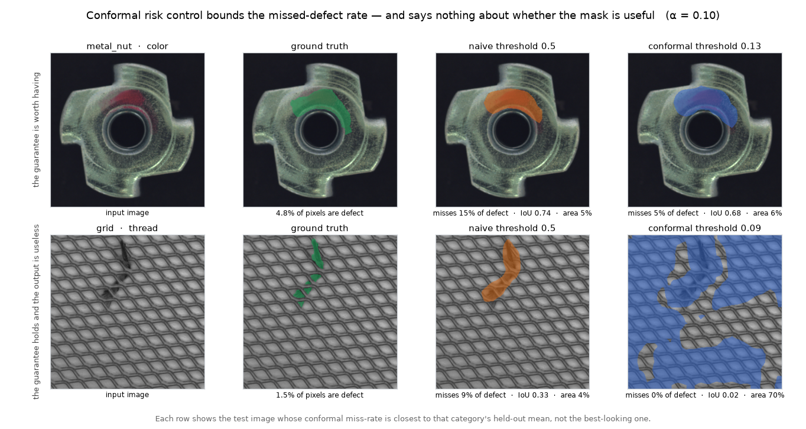

# conformal-seg

[](https://github.com/mateus-aleixo/conformal-seg/actions/workflows/ci.yml)


**Industrial defect segmentation whose masks carry a guarantee.** A torchvision
segmentation model fine-tuned on MVTec AD defects, thresholded by **conformal risk
control** so that the predicted defect region provably misses at most α of the true
defect pixels (pixel-level false-negative rate ≤ α, finite-sample,
distribution-free). Exported to ONNX with a parity check; inference runs torch-free.

Second of a series — one thesis, three modalities: *a prediction without a trustworthy
confidence statement is not a decision aid.*

| repo | modality | the guarantee |
|---|---|---|
| [conformal-rul](https://github.com/mateus-aleixo/conformal-rul) | sensor sequences | RUL intervals with verified coverage, live on AWS Lambda |
| **conformal-seg** | vision | defect masks bounding the missed-defect rate |
| [conformal-rag](https://github.com/mateus-aleixo/conformal-rag) | language | selective QA that abstains at a calibrated error rate |



*Top row: the method earning its keep — the calibrated mask is barely larger and
misses a third as much. Bottom row: the same method on a category the model never
learned, honouring its 10% promise by covering most of the frame. Both rows show the
test image closest to that category's held-out mean, not the best-looking one.*

> **Status: trained, calibrated, exported.** Full numbers in
> [`docs/results.md`](docs/results.md). The short version:
>
> | | naive 0.5 | conformal | verdict |
> |---|---|---|---|
> | `metal_nut` | IoU 0.691, **FNR 0.167 ✗** | IoU 0.644, **FNR 0.055 ✓** | guarantee costs ~5 IoU points and fixes a 17% miss rate |
> | `grid` | IoU 0.184, FNR 0.385 ✗ | IoU 0.015, **FNR 0.010 ✓**, **mask area 0.81** | guarantee honoured by flagging 81% of the image — valid and useless |
>
> `grid` is reported, not buried: conformal risk control guarantees *validity, not
> utility*, and a category where the model fails is the clearest way to show what
> the method does and does not buy you.

## Why a guarantee on a mask

The industrial question is never "colour the defect pixels", it is **"can this part
ship without a human looking at it?"** A raw sigmoid threshold gives no answer: 0.5
means nothing off-distribution. Conformal risk control does. Pick the mask threshold

λ̂ = largest λ such that (n/(n+1)) · R̂(λ) + 1/(n+1) ≤ α

where R̂(λ) is the mean fraction of true-defect pixels missed on a calibration split.
Under exchangeability, the deployed masks then miss **at most α of defect pixels in
expectation** — the exact worked example of Angelopoulos et al. (2022), implemented
here end to end: automate confidently above the bar, route to a human below it. The
same decision shape as automated visual verification anywhere: act only when the
model is *provably* careful enough, escalate the rest.

## Design

- **Data:** [MVTec AD](https://www.mvtec.com/company/research/datasets/mvtec-ad)
  (Bergmann et al., CVPR 2019), categories `metal_nut` and `grid`. MVTec AD is an
  anomaly-detection benchmark — defect masks exist only in its test split — so this
  repo follows the supervised protocol: the mask-annotated images are re-split
  60/20/20 into train/calibration/test, stated plainly here because the honest
  caveat is part of the method: n is small, and the conformal guarantee is exactly
  the tool that stays valid at small n.
  Licence **CC BY-NC-SA 4.0** — non-commercial research/portfolio use, attribution,
  data never redistributed; `scripts/fetch_mvtec.py` downloads and extracts.
- **Preprocessing:** openCV for decoding/resizing, pillow for mask handling and
  augmentation (flips, rotations) — deterministic under a seed.
- **Model:** torchvision `deeplabv3_mobilenet_v3_large`, pretrained backbone,
  1-channel defect head. Backbone frozen by default so the fine-tune fits a CPU
  overnight; unfrozen with one flag on a GPU.
- **Calibration:** `conformal.py` — conformal risk control over the threshold grid,
  FNR-vs-λ risk curve, held-out verification. Same correction, same small-n
  honesty as the sibling repos.
- **Export:** ONNX (opset 18) + parity check (max |Δ| logged); `predict.py` runs on
  onnxruntime only, no torch at inference — the conformal-rul serving pattern.
- **Tests/CI:** the suite runs on synthetic fixtures (random ellipse "defects"),
  no dataset, no pretrained weights, no network. Deterministic by construction.

## Quickstart

```bash
uv sync --all-extras                      # or: pip install -e ".[dev]"
uv run pytest                             # synthetic fixtures, CPU, no downloads
uv run python scripts/fetch_mvtec.py      # ~5.3 GB once; extracts 2 categories
uv run python -m conformal_seg.train --category metal_nut --unfreeze --lr 1e-4 --epochs 60
uv run python -m conformal_seg.calibrate --category metal_nut --alpha 0.1
uv run python -m conformal_seg.onnx_export --category metal_nut --check
uv run python -m conformal_seg.predict image.png --category metal_nut --mask out.png
```

**GPU note.** `pyproject.toml` pins CPU torch from PyPI, which is what CI wants.
For a CUDA build, install it into the venv and then invoke the venv's Python
directly — `uv run` re-syncs the environment from `pyproject.toml` on every call
and will silently put the CPU wheel back:

```bash
uv pip install --reinstall --index-url https://download.pytorch.org/whl/cu126 \
    "torch==2.13.0+cu126" torchvision
./.venv/Scripts/python.exe -m conformal_seg.train --category metal_nut --device cuda
```

## Roadmap

| Day | Deliverable | |
|---|---|---|
| D1 | README, scaffold, fetch script, synthetic-fixture test suite, CI | ✅ |
| D2–3 | Fine-tune `metal_nut`, frozen vs unfrozen, IoU reported | ✅ |
| D4 | Second category (`grid`); eval tables in `docs/results.md` | ✅ |
| D5 | Conformal masks: λ̂ per category, held-out FNR, mask area | ✅ |
| D6 | ONNX export + parity; torch-free `predict.py` | ✅ |
| Next | Tiled/high-res inference for `grid`; risk-curve plot; a defect-free control split | |

## References

- Angelopoulos, Bates, Fisch, Lei, Schuster — *Conformal Risk Control*, 2022.
- Bergmann, Fauser, Sattlegger, Steger — *MVTec AD: A Comprehensive Real-World
  Dataset for Unsupervised Anomaly Detection*, CVPR 2019.

MIT licence (code). Dataset under its own CC BY-NC-SA 4.0 terms.
Built by [Mateus Aleixo](https://github.com/mateus-aleixo).
