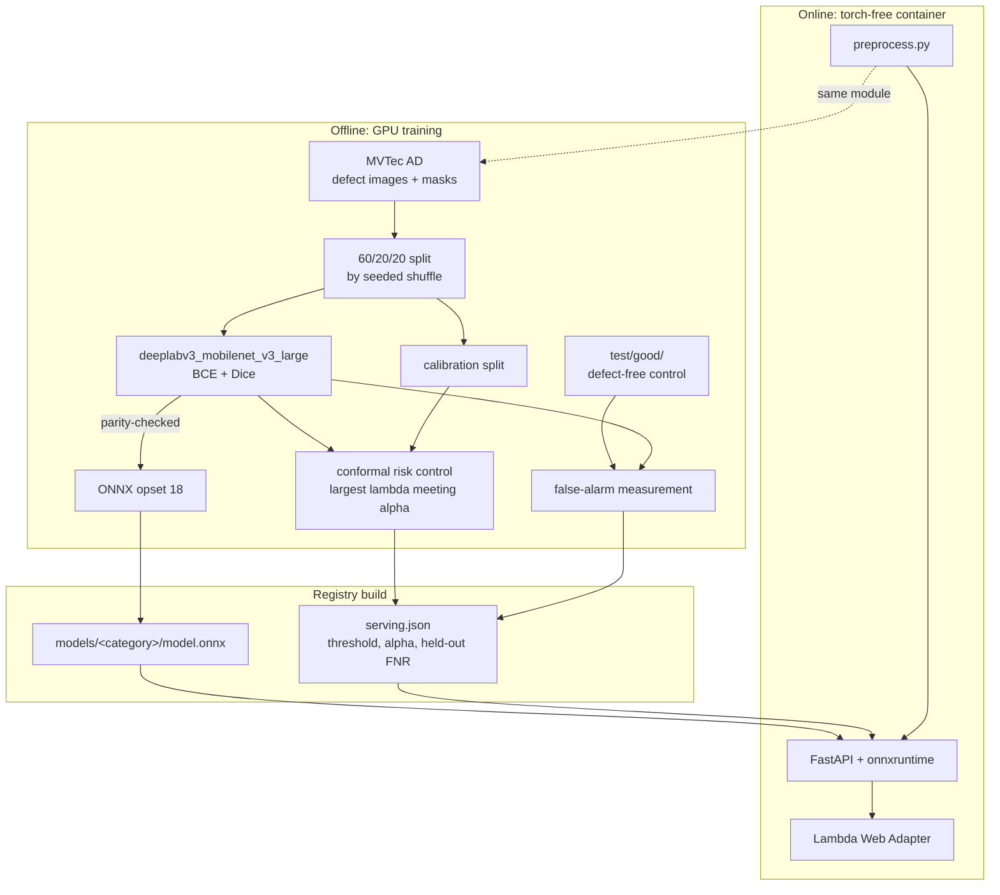

# Architecture

## The boundary that matters: a threshold is a statement about a pipeline

The calibrated threshold is not a property of the weights. It is a property of
the whole path from pixels to probabilities: decode, resize, normalise, network,
sigmoid. Serve an image that took a different path and the probability maps shift
underneath a threshold fitted for the old ones, and nothing raises. The layout
below exists to make that impossible.

`preprocess.py` is the dotted edge. It is imported by both `data.py` on the
training side and the serving app, so there is one implementation of decode,
resize and normalise rather than two that can drift. It is also the only reason
openCV stays in an otherwise minimal serving image.

For the same reason `registry.py` reads the input resolution **out of the ONNX
graph** rather than taking it from a flag. Serving at a resolution the threshold
was not calibrated for is the one silent failure that matters here.

## Request path

1. `POST /predict?category=…` with an image upload.
2. Decode and resize through `preprocess.py`, exactly as calibration did.
3. onnxruntime returns a per-pixel probability map.
4. Threshold at the calibrated λ̂ from `serving.json`.
5. Compare the flagged area against `min_area_frac` and return **pass** or
   **escalate**, with α, the threshold, the held-out FNR and the measured
   false-alarm rate attached.

The response is a decision, not a picture. A mask is an intermediate; an
inspection line acts on pass or escalate. `return_mask=true` adds the binary mask
as a base64 PNG for a human who wants to look.

## The two measurements, and why both ship

Conformal risk control bounds one thing: the fraction of true defect pixels the
mask misses. It is blind by construction to defect-free parts, which contain no
defect pixels to miss, and it buys its miss rate by lowering the threshold, which
can only flag more.

So the pipeline measures both sides:

- **`calibrate`** fits λ̂ on the calibration split and reports held-out FNR.
- The same command then scores MVTec's untouched `test/good/` images and reports
  the image-level false-alarm rate and flagged area at both the naive and
  calibrated thresholds.

Both land in `calibration.json`, both travel into `serving.json`, and both are on
every API response. `docs/results.md` carries the case where this matters: `grid`
honours α = 0.10 and escalates every clean part.

## Data invariants

- **Splits are by image, seeded, and fixed.** Seed 17, 60/20/20. The same seed
  gives the same split forever, so a reported number can be reproduced.
- **`discover_items` never returns `test/good/`.** Defect-free images have no
  mask and would contribute a loss of zero, flattering the calibration. They are
  reached only through `discover_good_items`, which is the control path.
- **The dataset is never committed.** MVTec AD is CC BY-NC-SA 4.0;
  `scripts/fetch_mvtec.py` downloads it.
- **The serving registry is not committed either**, at 42 MB of MobileNetV3 per
  category. It ships as a release asset that the deploy workflow fetches.

## Serving is torch-free

Training needs torch and torchvision. The container needs onnxruntime, openCV,
NumPy and pillow. The package is installed with `--no-deps` on top of a pinned
serving set, and CI asserts `import torch` fails inside the image, because the
`--no-deps` arrangement is one careless `pyproject` edit away from breaking and
the breakage is invisible until someone looks at a 2 GB image.

## CI/CD

- **ci.yml** lints with ruff, runs the suite against synthetic fixtures (random
  ellipse "defects", no dataset, no pretrained weights, no network), then builds
  the serving image, asserts it is torch-free, and smoke-tests the API. With no
  registry present `/models` must answer 503 rather than crash.
- **deploy.yml** fires on a `v*` tag: fetch the registry release asset, build,
  push to ECR, move the Lambda to the new image, then smoke `/health` **and**
  `/models`, because an image built without a registry starts happily and 503s on
  every prediction, which a health check alone would call green.
- Deploys authenticate by GitHub OIDC. No AWS keys exist anywhere. The IAM OIDC
  provider is shared with conformal-rul and read with a `data` block, never
  declared here; see [deploy.md](deploy.md).
